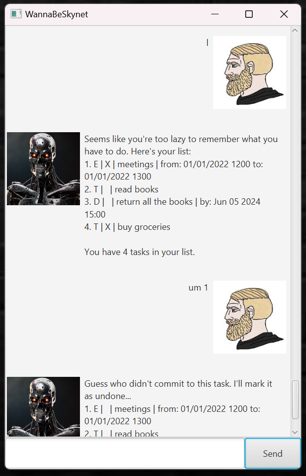

# WannaBeSkynet User Guide

## Introduction

🤖 **WannaBeSkynet** - Get your tasks efficiently managed by a (wannabe) sentient AI bot.

> "Your data is safe with me, I definitely won't use it at all." - WannaBeSkynet

Tired of the mortal struggle of remembering tasks? **WannaBeSkynet** is here to offload your memory onto silicon. This bot is a task manager that will help you keep track of your to-dos with a dash of **humorously** offensive charm.

## Get started in 3 simple steps

1. **Download the jar**: [Click here](https://github.com/PyromancerBoom/ip/releases/tag/A-Release) to download WannaBeSkynet.
2. **Launch**: Execute the jar file to awaken the bot. `java -jar bot.jar`
   - You need to have Java installed on your machine to run the bot.
   - The bot will create a `data` folder in the same directory as the jar file to store your tasks.
3. **Happy Tasking**: Start adding tasks and managing them with the bot.

## Features

Bot commands are case-insensitive, so don't worry about getting the capitalization right. Along with this, the bot supports **friendly syntax**, that is, shorthand commands - so you can type `l` instead of `list` and `m` instead of `mark`.

You can also work across multiple Operating Systems, as the bot is designed to be **cross-platform** compatible. The only requirement is that you have Java installed on your machine.

Besides that, this bot is designed to be **user-friendly** It will respond to your commands with a touch of personality.

Here's a list of commands you can use to interact with the bot:

### 1. Adding Tasks of multiple types

This bot supports three types of tasks: **To-Do**, **Deadline**, and **Event**.

#### To-Do Task

- Use: `todo <task_name>` or `t <task_name>`
- Example: `todo buy groceries`

#### Deadline Task

- Use: `deadline` or `d <task_name> /by <time>`
- Example: `d Steal moon by July 20 2029 20:00`
- Note: The time must be in the format `MMM dd yyyy HH:mm` (e.g. `Jul 20 2029 20:00`)

#### Event Task

- Use: `event` or `e <event_name> /from <time1> /to <time2>`
- Example: `e attend meetings /from Aug 13 2029 10:00 /to Aug 13 2029 23:00`
- Note: The time must be in the format `MMM dd yyyy HH:mm` (e.g. `Aug 13 2029 10:00`)

### 2. Viewing and searching Tasks

#### Listing all Tasks

To view the grand list of your tasks:

- Use: `list` or `l`
- This would include all your tasks, marked or unmarked.

#### Find Tasks

To search for tasks containing a specific keyword:

- Use: `find` or `f <keyword>`
- Example: `f something`
- This is case-insensitive.

### 3. Managing Tasks

#### Mark Task as Done

- Use: `mark` or `m <task_number>`
- Example: `m 1`

#### Unmark Task as Done

- Use: `unmark` or `um <task_number>`
- Example: `um 5`

#### Delete Task

- Use: `delete` or `del <task_number>`
- Example: `del 3`

### 4. Exiting the Program

- Use: `exit`, `quit`, or `q`
- Example: `quit`

### 5. Forgot a command?

Type `help` or `h` for a quick and short overview of the commands.
Alternatively, visit this guide again for a refresher.

### What it looks like

Here's a screenshot of the UI:

#### Hope you have fun!
